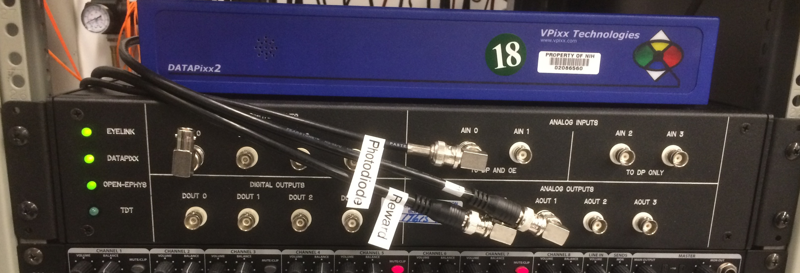

.. _InterfaceBox:

=============================
DataPixx Interface Box
=============================

In order to more efficiently and effectively route analog and digital
signals within the neurophysiology recording rigs, we designed an
interface box that minimizes signal paths, wire crossings, and reduces
the need for BNC cables. The box allows for the connection of four key
systems, allowing them to communicate analog and digital data with one
another:

  Figure 1. Datapixx Interface Box in 3U rack mounted format.

-  `VPixx DataPixx2 box <https://vpixx.com/products/datapixx2/>`_ (3 x DB25 connectors)
-  `SR Research EyeLink II <https://www.sr-research.com/eyelink-ii/>`_ (1 x 68-pin D-sub)
-  `Arrington Research ViewPoint <http://www.arringtonresearch.com/viewpoint.html>`_ 
-  `TDT RZ2 bioamp <https://www.tdt.com/component/rz2-bioamp-processor/>`_ (2 x DB25 connectors)
-  `Open Ephys board <https://open-ephys.org/acq-board>`_ (4 x HDMI connectors)

The NIF currently uses Arrington and iView video eye tracking systems as opposed to the SR Research EyeLink, but the DataPixx interface allows for the analog X, Y and pupil diameter / area signals from these trackers to be sent to the DataPixx box via BNC inputs. 

Additionally, the NIF's TDT system is recommended for simultaneous fMRI-electrophysiology, since the Open EPhys board does not provide sufficient headroom for gradient-induced voltage spikes in the electrophysiology signal.

Circuit
=======

The circuit, which is completely passive, was designed by Aidan Murphy
and Bruce Pritchard and constructed by Danny Trang in the NIMH `Section on
Instrumentation <https://www.nimh.nih.gov/research/research-conducted-at-nimh/research-areas/research-support-services/section-on-instrumentation/index.shtml>`_. The LEDs on the left of the front panel draw current from the connected systems in order to indicate which systems are currently connected to the box. The full schematic diagram can be found
:download:`here <_images/NTB_Images/SCNI_NeurophysInterfaceBox_20171119a_17615.pdf>`,
and a basic overview of the signal path is given below.

Analog signals
---------------

.. figure:: _images/NTB_Images/SCNI_InterfaceBox_2.png
  :figwidth: 50%
  :width: 100%
  :align: right

  Figure 2. Schematic of the Datapixx Interface Box's connections to other hardware devices.
  

The interface box houses a series of breakout boards:

* The eye signal boards in the SCNI interface boxes are `Data Translation DT330 <https://www.mccdaq.com/PDFs/Manuals/UM330.pdf>`_, which accepts the 68-pin D-sub cable that comes from the analog-out cards in the EyeLink PCs. 
* The eye signal boards in the NIF interface boxes are `CIO-MINI50 <https://www.mccdaq.com/productsearch.aspx?q=cio-mini>`_, which accept one 50-pin connector from the 100-channel ribbon cable from the Arrington ViewPoint analog output PCI card.

The six channels of eye signal (X, Y and pupil for both
left and right eyes) are routed via filtering stages (consisting of a 50
Ohm resistor and a 1uF capacitor) to the first 6 analog input channels
of the DataPixx2, the TDT RZ2, and the Open Ephys board. An additional
four channels of analog input are taken from the BNC connectors on the
top right corner of the interface box front panel (all 4 are routed to
DataPixx and TDT, while only the first 2 are routed to Open Ephys).

The four analog output channels from the DataPixx are routed to the four
BNC connectors on the bottom right corner of the interface box front
panel.

Digital signals
---------------

The first four digital output channels of the DataPixx2 are routed to
both the four BNC connectors on the top left of the interface box
front panel, as well as the first four digital input channels of the
TDT RZ2 and the Open Ephys board. The remaining digital outputs from
the DataPixx2 are routed to the remaining TDT digital inputs.
The DataPixx2 receives four digital inputs from the BNC connectors on
the front panel of the interface box, and four directly from the Open
Ephys board's digital outputs.

