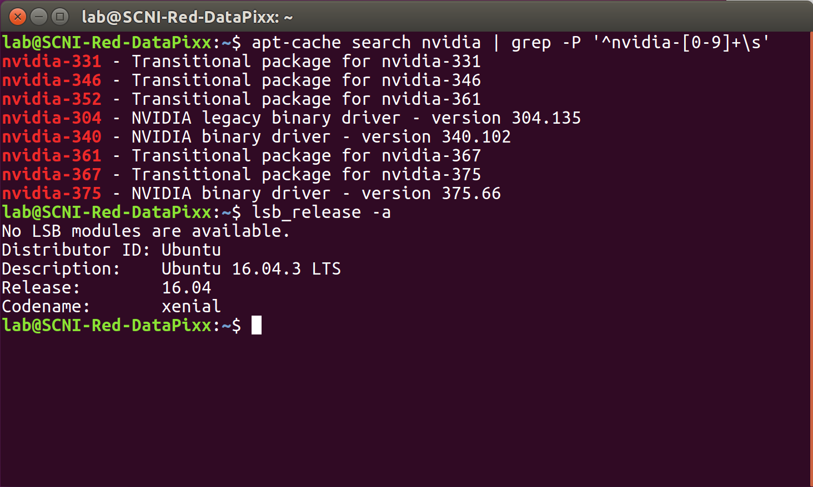
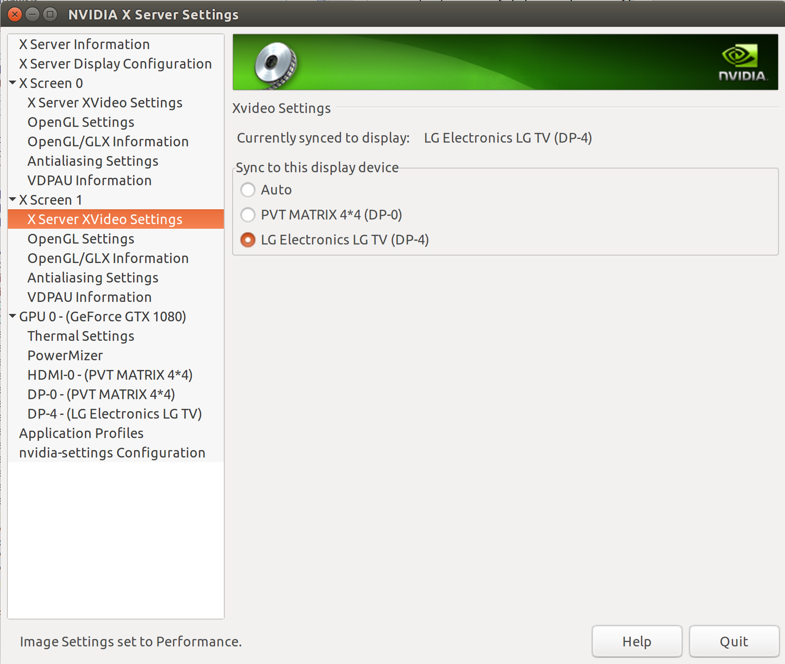
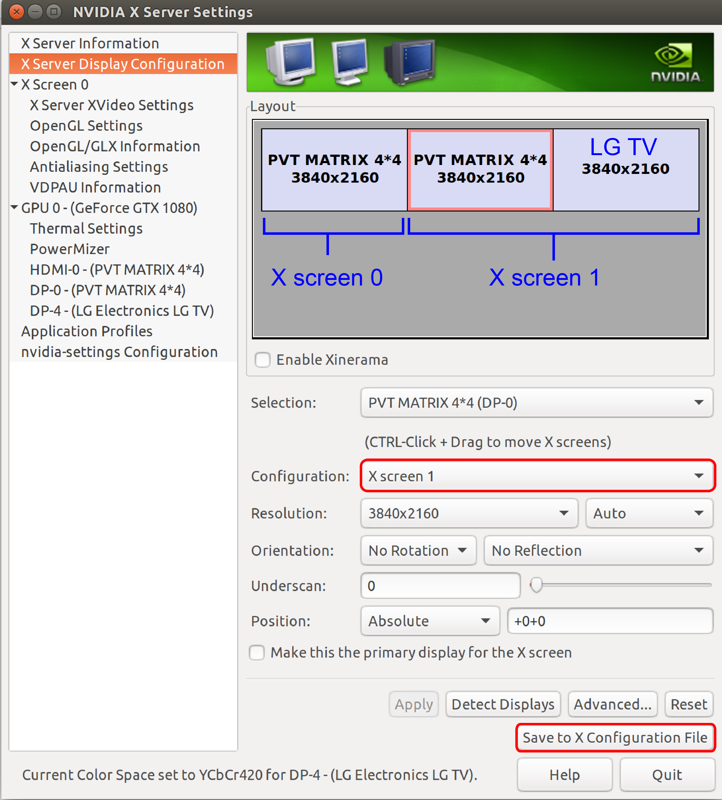

.. _SystemInstall:

=======================
System Installation
=======================

.. panels::
  :column: col-lg-12 p-0 border-1
  :header: bg-warning text-bold text-dark p-1
  :body: bg-warning text-dark border-0 p-2 
  
  :fa:`exclamation-triangle` **Warning**
  ^^^^^^^^^^^^^^^^^^^^^^^^^^^^^^^^^^^^^^^

  NIF users **should not make changes to any computer system** in the NIF without the permission and direct supervision of a member of the NIF support team! The NIF is a shared resource and any changes made to these systems will affect all NIF users research.

.. panels::
  :column: col-lg-12 p-0 border-1
  :header: bg-primary text-bold p-1 pl-2
  :body: bg-secondary border-0 p-2

  :opticon:`info,mr-1` **Note**
  ^^^^^^^^^^^^^^^^^^^^^^^^
  If you encounter issues that you believe to be related to system updates or changes, please contact `NIF support <nifadmins@mail.nih.gov>`_ so that we can help to resolve the problem for all users.

The following instructions describe the process for setting up the standard configuration used in the NIF and SCNI for DataPixx stimulus presentation PCs. The specific hardware and software selections have been driven primarily by the recommendations of
VPixx and Mario Kleiner at PsychToolbox circa 2016. NIF Toolbar's default settings expect this type of setup, but can be configured to operate in alternative environments (e.g. other OSs, and with more or fewer displays).

For this purpose, we have typically ordered high-specification custom workstation PCs in rack mount chassis, from companies like `ADEK <https://adek.com/>`_, or assembled our own. If ordering a complete PC it is recommended to request at the time of order that the system should be a Windows - Ubuntu dual boot installation, and that we will be running power-hungry GPUs (so that the supplier can provide an appropriately rated power supply).

.. contents:: :local:

NIF Datapixx Systems
======================

The following NIF and SCNI Datapixx PCs can be accessed remotely from a computer connected to the NIH network or via VPN. We recommend installing the cross-platform remote desktop application `NoMachine <https://www.nomachine.com/>`_ on your local computer for this (see figure below). 

.. panels::
  :column: col-lg-12 p-0 border-1
  :header: bg-warning text-bold text-dark p-1
  :body: bg-warning text-dark border-0 p-2 
  
  :fa:`exclamation-triangle` **Warning**
  ^^^^^^^^^^^^^^^^^^^^^^^^^^^^^^^^^^^^^^^
  Remote connections should not be made to DataPixx PCs during working hours unless you are certain that they are not in use by other researchers. If you observe that a DataPixx PC is in use when you connect remotely, please disconnect in order to give priority to those physically at the computer.

.. csv-table::
  :file: _static/CSVs/DataPixxPCs.csv
  :header-rows: 1
  :widths: 15 10 10 10 15 5 6 6 10 10
  :align: left

- To connect to a DataPixx PC remotely via **NoMachine**: 

  - Give the connection an appropriate name
  - Select the 'NX' protocol
  - Enter the IP address for the computer you want to connect to (as listed in the table above)
  - Select the default 'Port' as 4000
  - When prompted, enter the username 'lab' and the standard lab password.

- To connect via **SSH** open a Terminal window and type the following, replacing the IP address with the one corresponding to the computer that you want to connect to (as listed in the table above): :code:`ssh lab@156.40.249.82` 

- To connect via **X11vnc**, type:

:code:`x11vnc -rfbauth ~/.vnc/passwd -auth /run/user/1000/gdm/Xauthority -forever -nowf -repeat -display :0`

- To connect via VNC on a Mac:
  - Open a Finder window
  - Select Go -> Connect to Server 
  - Type `vnc://156.40.249.82` (replacing the IP address with the computer you want to connect to).

Ubuntu Installation
=====================

.. |UbuntuVer| replace:: 20.04 LTS

-  Follow the `online instructions <https://ubuntu.com/tutorials/install-ubuntu-desktop#1-overview>`_ for installing Ubuntu |UbuntuVer|.
-  Create “lab” user with admin permissions and standard lab password.
-  

Install aptitude and update all packages
----------------------------------------

Aptitude is a friendlier apt-get, use either based on your preference.

::

    sudo apt-get install aptitude
    sudo apt-get install subversion
    sudo apt install linux-low latency-hwe-20.04
    sudo aptitude update
    sudo aptitude upgrade -y
    sudo aptitude install build-essential
    sudo reboot

Install Graphics Card Drivers
=======================================

.. panels::
  :column: col-lg-12 p-0 border-1
  :header: bg-primary text-bold p-1 pl-2
  :body: bg-secondary border-0 p-2

  :opticon:`info,mr-1` **Note**
  ^^^^^^^^^^^^^^^^^^^^^^^^
  Most NIF and SCNI DataPixx PCs currently have Nvidia GTX 1000-series GPUs, which were the recommended GPU at the time of purchase (circa 2016). Since then, AMD have become the preferred GPU manufacturer for use in PsychToolbox (PTB) setups. This is primarily because open-source drivers (e.g. `MESA <https://www.mesa3d.org/>`_) for these cards are more efficient than the the open-source `nouveau <https://nouveau.freedesktop.org/wiki/>`_ drivers for Nvidia cards, which yield less than 10% of maximum card performance (compared to the proprietary Nvidia drivers).

-  Logged in as `nifsupport`, download the appropriate `NVidia drivers <http://.www.nvidia.com/Download/index.aspx>`_ and save to the nifsupport `downloads` directory.

-  Restart the PC and at the GRUB screen, select 'Ubuntu Advanced'

-  From the log in screen, hit 'Ctrl + Alt + F2' to get to a command
   line

-  Log in as Root ('Root' plus nifsupport password)

:: 

   service lightdm stop
   cd /nif-admin/downloads
   ./NVIDIA-XXX...

-  Accept the various terms and conditions of the NVidia driver
   installation process

-  When the installer is finished type::

   service lightdm start

-  Login as lab, use the Ubuntu search function to open the NVidia X
   Server Settings (and pin to dock)

-  The following instructions are adapted from this blog post:
   http://abhay.harpale.net/blog/linux/nvidia-gtx-1080-installation-on-ubuntu-16-04-lts/

-  With graphics card model number in hand, head over to
   `Nvidia <http://www.nvidia.com/Download/index.aspx>`_ and download & install the
   appropriate driver.

-  The NIF's primary DATAPixx PC was setup by VPixx to run dual boot
   Ubuntu 16.04 and Windows 7 and has the NVIDIA drivers correctly
   installed for the NVIDIA GTX 1060 card. The specific drivers
   installed on that machine are shown in the screenshot below.

Mount Nifstorage shares
--------------------------

- Add NFS mounts to /etc/fstab

:code:`sudo mount -a`

Install NeuroDebian
-------------------

:: 

  wget -O- http://neuro.debian.net/lists/focal.us-nh.full | sudo tee /etc/apt/sources.list.d/neurodebian.sources.list
  sudo apt-key adv --recv-keys --keyserver hkp://pool.sks-keyservers.net:80 0xA5D32F012649A5A9
  sudo apt-get update

Install Blender and Python modules
------------------------------------

- Download and install `UPBGE <https://upbge.org/>`_, the Blender-based game engine used for real-time 3D rendered visual stimulation experiments.

:: 

     sudo add-apt-repository ppa:thomas-schiex/blender
     sudo apt-get update
     sudo apt-get install blender

Install Matlab & PsychToolbox
-----------------------------

-  Login to the Mathworks account linked to your NIMH e-mail address:
   https://www.mathworks.com/login

-  Download, install and activate MATLAB using your account.

:: 

    sudo apt-get install matlab-psychtoolbox-3

-  Install Linux low-latency drivers:

:: 
    sudo apt install linux-low latency-hwe-20.04

Install DataPixx Tools
----------------------

-  Copy the Datapixx mex file for 64-bit Linux, (e.g. 
   ``/projects/SCNI/Software/VPixx_Software_Tools/DatapixxToolbox_trunk/mexdev/build/matlab/linux64/Datapixx.mexa64``)
     to the PsychBasic folder of your matlab installation (e.g.:
     ``/usr/share/psychtoolbox-3/PsychBasic``)

:: 

    sudo mv /home/lab/Documents/Datapixx.mexa64 /usr/share/psychtoolbox-3/PsychBasic

-  In order to run Datapixx functions without running Matlab or Octave
   as root user (i.e., without need for root login or the sudo command):

:: 

    sudo cp Psychtoolbox/PsychHardware/DatapixxToolbox/60-vpixx-permissions.rules /etc/udev/rules.d/

-  Connect to NIF storage again and copy
   ``/Volumes/LIBRARY/software/VPixx_Software_Tools.zip`` to
   ``~lab/Downloads``.

-  Unzip VPixx\ *Software*\ Tools.zip

-  Add
   `/home/lab/Downloads/VPixx_Software_Tools/DatapixxToolbox_trunk/`
   to MATLAB's path.

.. _SetupNvidiaXscreens:

Setup NVIDIA X-Screens
========================

-  Connect displays (or matrix switch inputs) to 3 of the display port
   outputs on the NVIDIA GTX 1080 card

-  In Ubuntu, open the **NVIDIA XServer Settings** manager and select
   **XServer display configuration**

-  Click and drag to arrange your displays from left to right: 1) Matlab
   command line 2) Experimenter display 3) Monkey display

-  Select display 2, click the drop down menu next to ``Configuration``
   and select ``Add new Xscreen``

-  Set display 1 to use Xscreen 0 and displays 2 and 3 to use Xscreen 1

-  Click the **Save to X Configuration File** button

-  You will be propted to overwrite the existing file. Accept.

-  After reboot, the new settings will take effect. The experimenter
   display and monkey display will now remain black after logon. Content
   will only appear on these screens when we tell Matlab to open a
   PsychToolbox window on Xscreen 1. Both the experimenter and monkey
   displays are treated as a single extended window (7680 x 2160 pixels)
