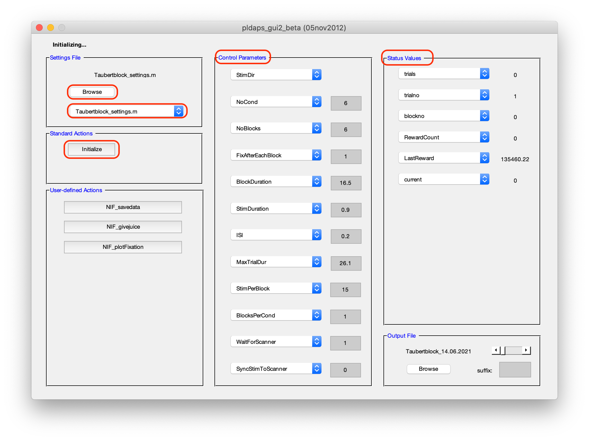

.. _NIF_PLDAPS:

===================================
NIF PLDAPS
===================================

A brief history
-----------------

The NIF began using Datapixx interface with a single Ubuntu PC running Matlab and PsychToolbox in 2017. This replaced the previous experimental control system, which was a client-server system involving a realtime QNX operating system that handled analog and digital IO and timing and send messages via TCP/IP to a second PC running Matlab and PsychToolbox that handled stimulus presentation. DataPixx was recommended to the NIF by Richard Krauzlis in NEI, whose lab used VPixx hardware in conjucntion with the `PLDAPS <https://github.com/HukLab/PLDAPS>`_ Matlab code developed by `Alex Huk's group <https://motion.cps.utexas.edu/people/alex-huk/>`_, and had developed their own graphical user interface (GUI) for handling experiments. This page documents the structure of experimental code written to work with Rich's PLDAPS GUI.

pldaps_gui2_ms
-----------------

The main GUI was written by `Richard Krauzlis <https://www.nei.nih.gov/research/research-labs-and-branches/we-are-nei-intramural/richard-krauzlis>`_ using Matlab's `GUIDE <https://www.mathworks.com/help/matlab/creating_guis/about-the-simple-guide-gui-example.html>`_ feature for GUI creation. Development began in 2012 and the last update of the version generously shared with the NIF was made in April 2017. Due to the nature of Matlab's GUIDE, the GUI is difficult to edit and it is not recommended to attempt to do so (indeed GUIDE is due to be removed from Matlab since being replaced by the `App Designer <https://www.mathworks.com/help/matlab/app-designer.html>`_). 

The GUI is composed of two files: pldaps_gui2_ms.fig and pldaps_gui2_ms.m. It can be run by changing directory to where the GUI files are located and typing :code:`pldaps_gui2_ms` in the Matlab command line. 

Settings file
----------------

Experiment files
------------------

