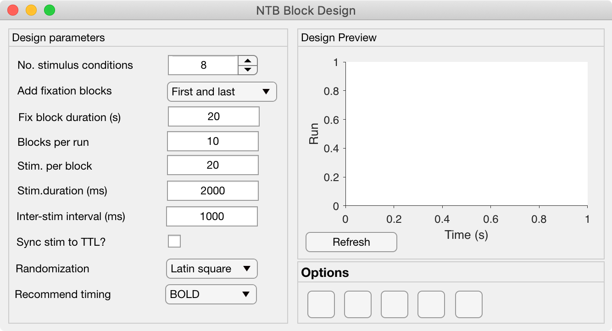

.. _NTB_BlockDesign:

=======================================
|Block| NTB Block Design
=======================================

.. NTB_BlockDesign:

The Block Design GUI allows the user to quickly set variables for generating block design sequences for task-related fMRI experiments. All variables controlled by the Block Design GUI are saved to the :ref:`Block <Params-Block>` of the **Params** object.

Theoretical notes
==========================

The optimization of block designs in fMRI suggest that  (`Maus et al., 2010 <https://doi.org/10.1007/s11336-010-9159-3>`_)

The order in which experimental conditions occur should obviously be pseudo-randomized, but more specifically there are several options for avoiding sequence repetitions, such as:
- Latin square (e.g. `Bianciardi et al., 2004 <https://doi.org/10.1016/j.neuroimage.2004.02.039>`_)
- M-sequences (e.g. `Buračas & Boynton, 2002 <https://doi.org/10.1006/nimg.2002.1116>`_).

Design Parameters Panel
===========================

- **No. Stimulus conditions**:

- **Add fixation blocks**:

- **Fix block duration (s)**:

- **Blocks per run**:

- **Stim. per block**: 

- **Stim. Duration (ms)**:

- **Inter-stim interval (ms)**:

- **Sync stim to TTL?**:

- **Randomization**: Select how to randomize conditions within and across blocks. Th options are:
  - Latin square: pseudo-randomized order with no repetitions of AB sequences
  - M-sequence: 
  - Totally random: pseudo-random order with no further constraints
  - 

- **Recommend timing**: This optional dropdown menu allows the user to select the fMRI signal / acquisition type being used in order to set recommended timing parameters (mainly block duration). The defaults are:
  - BOLD: set block duration to 20s
  - MION: set block duration to 40s
  - ZTE: set block duration to 60s

Design Preview Panel
===========================

.. _Params-Block:

Params.Block fields
======================

.. csv-table:: 
  :file: _static/ParamsCsv/Block.csv
  :header: Subfield, Full field, Description
  :align: left
  :widths: 20 40 40

