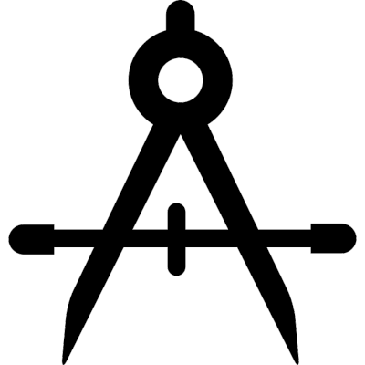

===================================
|Calib| NTB Calibrations Tab
===================================

.. NTB_CalibrationsTab:

The Calibrations tab of the NIF Toolbar GUI allows the user to test and calibrate various aspects of the hardware and software, for optimal performance during experiments.

.. |Grid| image:: _images/NTB_Icons/W_Cal.png
  :height: 40
  :alt: Spatial

.. |SpatialDesc| replace:: Presents customized grids on the subject's display in order to perform spatial calibrations of the projectors (e.g. centering, keystone distortion, etc.)

.. |LumDesc| replace:: Screen luminance measurement.

.. |Gamma| image:: _images/NTB_Icons/W_GammaCorrect.png
  :height: 40
  :alt: Gamma

.. |GammaDesc| replace:: Calculation of normalized Gamma color look-up tables (CLUTs) for linear display luminance.

.. |Reward| image:: _images/NTB_Icons/W_Liquid.png
  :height: 40
  :alt: Manual reward

.. |RewardDesc| replace:: Perform automated liquid reward delivery at different system pressure levels to calculate volume (ml) per unit time (ms) of solenoid valve opening.

.. |Photodiode| image:: _images/NTB_Icons/W_Photodiode.png
  :height: 40
  :alt: Photodiode

.. |PhotodiodeDesc| replace:: Test expected photodiode input signals (analog / digital) across a range of luminance changes in order to check placement and determine appropriate marker settings.

.. |EPI| image:: _images/NTB_Icons/W_EPI.png
  :height: 40
  :alt: EPI

.. |EPIDesc| replace:: Test expected scanner TTL pulse input to make sure that pulses are accurately detected and stimulus timing is locked to scanner TRs.

.. table:: 
  :widths: 10 20 70
  :align: left
  :class: special
  
  +--------------+-------------------------------+-----------------------------------------+
  | Icon         | Calibration                   | Brief Description                       |
  +==============+===============================+=========================================+
  ||Grid|        | **Display - Spatial**         | |SpatialDesc|                           |
  +--------------+-------------------------------+-----------------------------------------+
  ||Luminance|   | **Display - Luminance**       | |LumDesc|                               |
  +--------------+-------------------------------+-----------------------------------------+
  ||Gamma|       | **Display - Gamma**           | |GammaDesc|                             |
  +--------------+-------------------------------+-----------------------------------------+
  ||Reward|      | **Reward volume**             | |RewardDesc|                            |
  +--------------+-------------------------------+-----------------------------------------+
  ||Photodiode|  | **Photodiode marker**         | |PhotodiodeDesc|                        |
  +--------------+-------------------------------+-----------------------------------------+
  ||EPI|         | **Scanner sync.**             | |EPIDesc|                               |
  +--------------+-------------------------------+-----------------------------------------+

