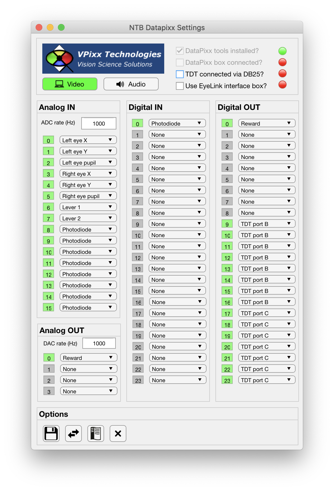
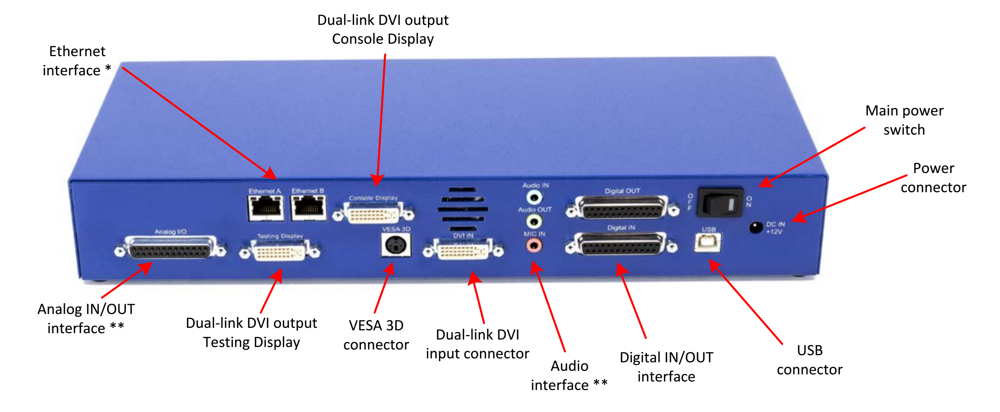

.. |DPx_icon| image:: _images/NTB_Icons/Datapixx.png
  :align: bottom
  :height: 30
  :alt: NTB Datapixx Settings

.. _NTB_DatapixxSettings:

===================================
|DPx_icon| NTB Datapixx Settings
===================================

The NTB Datapixx Settings GUI allows the user to quickly make changes to parameters related to the analog and digital I/O capabilities of the `VPixx DataPixx interface box <https://vpixx.com/products/datapixx2/>`_. All variables controlled by the Datapixx Settings GUI are saved to the :ref:`DPx field <Params-DPx>` of the **Params** object.

Top Panel
======================

The top panel:

* **Video** enable button: this button is green when pressed, and indicates that the video signal from the PC's graphics card is being routed through the DataPixx box via the DVI connectors. If the video signal is not being based through the DataPixx box then this button should not be pressed.
* **Audio** enable button: this button is green when pressed, and indicates that the audio signal is being routed via the DataPixx box via the 1/8" mini stereo jacks. If the audio signal is not being passed through the PataPixx box then this button should not be pressed.
* **VPixx Technologies**: clicking the VPixx logo will open VPixx' DataPixx Toolbox documentation web page in a browser.

  Rear panel connections of the DataPixx 2 interface box used in the NIF and SCNI for analog and digital I/O.

To the right of the top panel, four check boxes induce the following:

* **DataPixx tools installed?**: this non-editable checkbox indicates whether the `DataPixx Toolbox <http://www.vpixx.com/manuals/psychtoolbox/html/>`_ was found on the Matlab path. This must be installed in order for Matlab to communicate with the DataPixx box. Note also that an earlier version of the DataPixx Toolbox is installed when `PsychToolbox <http://psychtoolbox.org/>`_ is installed, but that it is `recommended to update the DataPixx Toolbox <http://www.vpixx.com/manuals/psychtoolbox/html/install.html>`_ after PsychToolbox installation.
* **DataPixx box connected?**: if the DataPixx toolbox is installed (as indicated above) then this non-editable checkbox indicates whether the DataPixx interface box is currently powered on and connected to the PC via USB.
* **TDT Connected via DB25?**: this user editable checkbox tells the GUI whether the `Digital Out` DB25 connector of the DataPixx 2 interface box is connected directly to the 'Digital In' DB25 connector of the TDT RZ2 Bioamp for neurophysiology recording. If so, the appropriate channels of the DataPixx's digital out are automatically assigned to the TDT and cannot be edited.
* **Use EyeLink interface box?**: this user editable checkbox tells the GUI whether the `Analog I/O`, `Digital In` and `Digital Out` DB25 connectors of the DataPixx 2 interface are connected to the `Interface box <>`_. The interface box partially constrains which signals will appear of which channels, and the GUI will update to reflect these fixed mappings.

DAQ Tab
=================

This panel controls channel assignments for the data acquisition (DAQ) analog and digital I/O functions of the DataPixx.

Analog In
-----------------

**ADC rate (Hz)** 

Dropdown boxes

Analog Out
-----------------

Digital In
-----------------

Digital Out
-----------------

PsychDPx Tab
=================

This panel controls the settings of the DataPixx Toolbox functions that integrate with PsychToolbox, related to video display and timing.

Test Tab
=================

This tab allows rudimentary testing of the connected DataPixx by reading and plotting incoming signals or setting output signals to selected values. This can be useful for verifying connections and basic debugging.

Options Panel
==================

.. |GUIname| replace:: Datapixx

The Options panel is standardized across NTB Settings GUIs and contains buttons with icons indicating their function as listed below. You can also hover the cursor over the GUI buttons to see the tooltips description of each button's function.

.. |Save| image:: _images/NTB_Icons/W_Save.png
  :width: 30
  :alt: Save

.. |SaveDesc| replace:: Saves the current |GUIname| parameter values to the currently loaded Parameters file.

.. |LoadDesc| replace:: Allows the user to select a different Parameters file from the current one, and load only the |GUIname| parameters from that file.

.. |Help| image:: _images/NTB_Icons/W_ReadTheDocs.png
  :width: 30
  :alt: Documentation

.. |HelpDesc| replace:: Opens the NTB |GUIname| Settings GUI documentation page (this page) in a web browser.

.. |CloseDesc| replace:: Closes the NTB |GUIname| Settings GUI and returns the updated variables to the Params structure of the main NIF Toolbar.

.. table::
  :align: left
  :widths: 10 10 80

  +------------+-------------+----------------+
  | Icon       | Function    | Description    |
  +============+=============+================+
  | |Save|     | **Save**    | |SaveDesc|     |
  +------------+-------------+----------------+
  | |Load|     | **Load**    | |LoadDesc|     |
  +------------+-------------+----------------+
  | |Help|     | **Help**    | |HelpDesc|     |
  +------------+-------------+----------------+
  | |Close|    | **Close**   | |CloseDesc|    |
  +------------+-------------+----------------+

.. _Params-DPx:

Params.DPx Fields
===================

.. csv-table:: 
  :file: _static/ParamsCsv/DPx.csv
  :header: Subfield, Full field, Description
  :align: left
  :widths: 20 40 40

