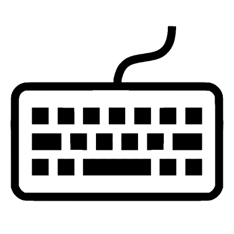

.. _NTB_KeyboardSettings:

===================================
|Keyboard| NTB Keyboard Settings
===================================

.. NTB_KeyboardSettings:

.. figure:: _images/NTB_GUIs/NTB_DisplaySettings.png
  :align: right
  :figwidth: 30%
  :width: 100%
  :alt: NTB Keyboard Settings

The :badge:`Keyboard Settings,badge-success` GUI allows the user to quickly set variables affecting .... All variables controlled by the Keyboard settings GUI are saved to the :ref:`Keys field <Params-Keys>` of the Params structure.

Params.Keys fields
======================

.. _Params-Keys:

Some stuff here

