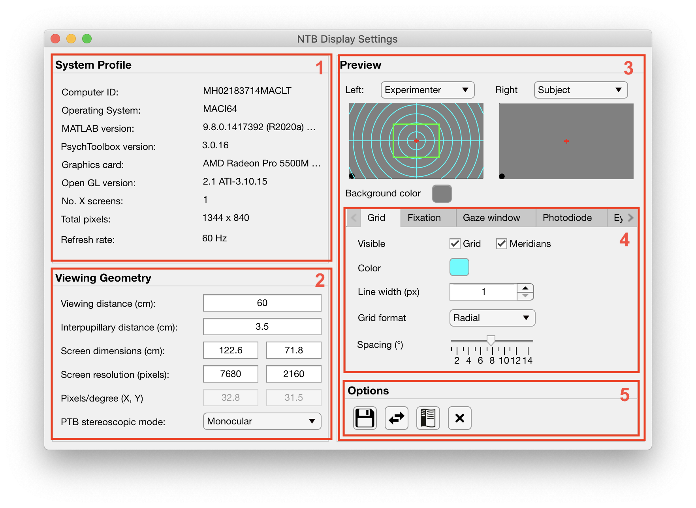

.. |Movie| image:: _images/NTB_Icons/Movie.png
  :align: bottom
  :height: 30
  :alt: NTB Movie Settings

.. _NTB_MovieSettings:

=============================================
|Movie| NTB Movie Experiment Settings
=============================================

The Movie Experiments settings GUI allows the user to quickly set parameters for experiments involving the visual presentation of video(s). All variables controlled by the Movie settings GUI are saved to the :ref:`Movie field <Params-Movie>` of the Params object.

Params.Movie fields
======================

.. _Params-Movie:

Some stuff here

