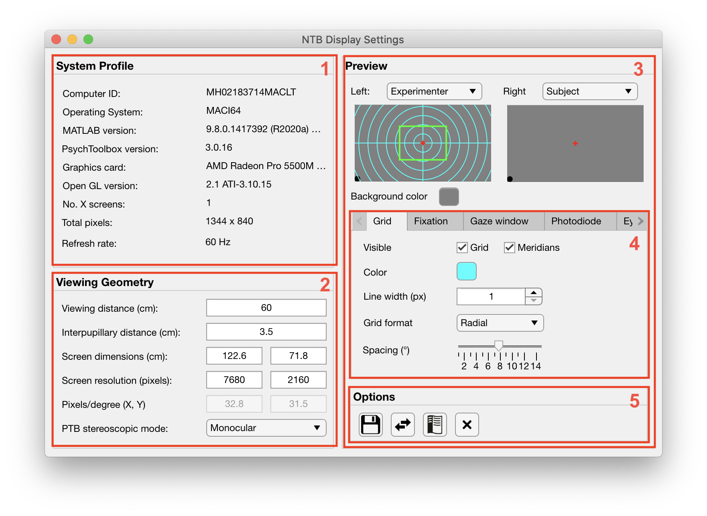

.. |Reward| image:: _images/NTB_Icons/Liquid.png
  :align: bottom
  :height: 30
  :alt: NTB Reward Settings

.. _NTB_RewardSettings:

===================================
|Reward| NTB Reward Settings
===================================

.. NTB_RewardSettings:

The Reward Settings GUI allows the user to quickly set variables affecting the reward schedule for the subject based on timing and/or performance. All variables controlled by the Reward settings GUI are saved to the :ref:`Reward field <Params-Reward>` of the Params structure.

Params.Reward fields
======================

.. _Params-Reward:

Some stuff here

