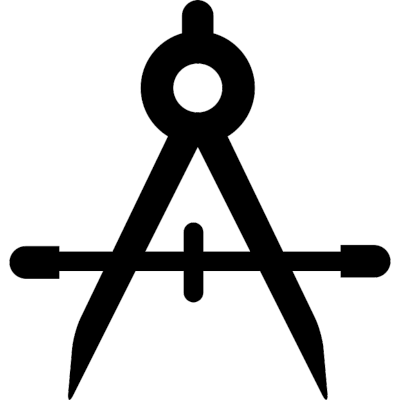
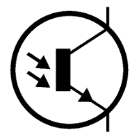

.. _PTB_CalibrationsTab:

===================================
|Calib| PTB Calibrations Tab
===================================

.. PTB_CalibrationsTab:

The :badge:`Calibrations,badge-primary` tab of the Psych Toolbar GUI allows the user to test and calibrate various aspects of the hardware and software, for optimal performance during experiments.

.. |Reward| image:: _images/PTB_Icons/Liquid.png
  :height: 40
  :alt: Manual reward

.. |EPI| image:: _images/PTB_Icons/EPI.png
  :height: 40
  :alt: EPI

.. csv-table:: 
  :file: _static/CSVs/PTB_CalibrationsTab.csv
  :header-rows: 1
  :widths: 10 20 70
  :align: left
  :class: special
  