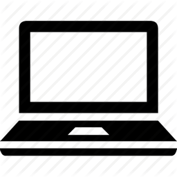
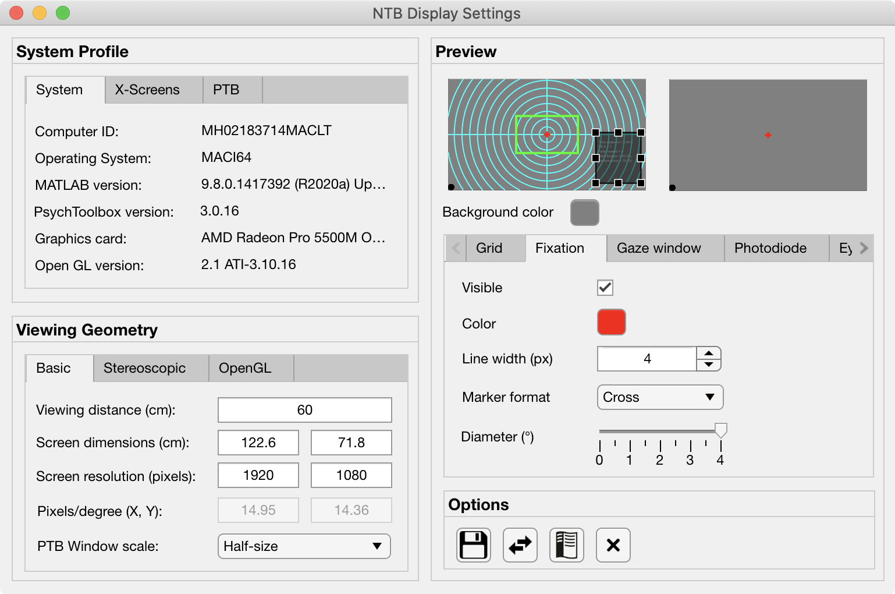
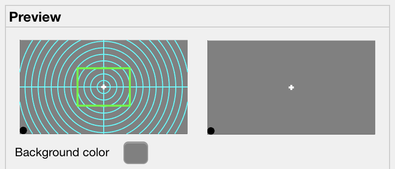
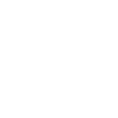

.. _PTB_DisplaySettings:

===================================
|DS_icon| PTB Display Settings
===================================

The :bdg-success:`Display Settings` GUI allows the user to quickly make changes to parameters that will affect aspects of the visual display for both the subject and the experimenter. All variables controlled by the Display Settings GUI are saved to the :ref:`Display field <Params-Display>` of the **Params** object.

The original display trick proposed by VPixx when using the DataPixx 2 is to use modified `color look-up tables (CLUTs) <http://www.vpixx.com/manuals/psychtoolbox/html/PROPixxDemo7.html>`_ in order to efficiently draw a copy of what the subject is viewing to a second display for the experimenter, with additional information overlaid such as eye position. However, this approach will not work for 24-bit color RGB content such as photo images and movies.

Instead, we utilize the multihead outputs of modern graphics cards together with the ability of graphics management software to combine multiple physical display monitors as a single `X-Windows <https://en.wikipedia.org/wiki/X_Window_System>`_ screen. By opening a single `PsychToolbox window <http://psychtoolbox.org/docs/Screen>`_ that spans a single X-screen but 2 physical displays, we can efficiently draw copies for both subject and experimenter.

.. contents::  :local:

Profile Panel
======================

.. tab-set:: 

  .. tab-item:: System Tab

    .. figure:: _images/PTB_GUIs/PTB_DisplaySettings/DisplaySettings_SystemProfile_SystemTab.png
      :align: right
      :figwidth: 40%
      :width: 100%
      :alt: Display Settings System tab.

    The :bdg-primary:`System` tab of the :bdg-secondary:`System Profile` panel doesn't contain any editable fields, but displays automatically detected information about the current environment in which the GUI is running. This can be useful for confirming that the Psych Toolbar is being run on a computer with the correct software and hardware for the experimental demands.

    * :bdg-secondary:`Computer ID`: identifying string for computer retreived via :code:`system('hostname')`.

    * :bdg-secondary:`Operating System`: operating system of computer that PTB is currently running on, retrieved via :code:`computer`.

    * :bdg-secondary:`MATLAB version`: Matlab version that PTB is currently running on, detected via :code:`version`.

    * :bdg-secondary:`PsychToolbox version`: PsychToolbox version that is currently installed don the Matlab path, detected via :code:`PsychtoolboxVersion`.

    * :bdg-secondary:`Graphics card`: GPU of current system detected via :code:`opengl('data')`.

    * :bdg-secondary:`Open GL version`: OpenGL version of current system detected via :code:`opengl('data')`.

  .. tab-item:: X-Screens Tab

    .. _DS_XScreensTab:

    .. figure:: _images/PTB_GUIs/PTB_DisplaySettings/DisplaySettings_SystemProfile_XScreensTab.png
      :align: right
      :figwidth: 40%
      :width: 100%
      :alt: Display Settings X-screens tab.

    The :bdg-primary:`X-screens` tab of the :bdg-secondary:`System Profile` panel displays information about the physically connected video displays and their software arrangement (as `X-Windows <https://en.wikipedia.org/wiki/X_Window_System>`_). For details on how Psych Toolbar expects displays to be managed by the operating system graphics drivers, see the :ref:`system installation page <SetupNvidiaXscreens>`.

    .. _DS_NoXScreens:

    * :bdg-secondary:`No. X screens`: the number of X-screens that PsychToolbox was able to detect using :code:`numel(Screen('Screens'))`. If only 1 X-screen is detected then this will be highlighted in red, since opening a full-screen PTB window will obscure the Matlab window and the PTB GUI.

    .. _DS_SelectedXScreen:

    * :badg-primary:`Selected X-Screen`: the ID number of the currently detected X-screens that a PTB window should be opened on. Note that this uses zero-based numbering and cannot exceed the number of detected :ref:`X-screens <DS_NoXScreens>`.

    .. _DS_TotalResolution:

    * :bdg-secondary:`Total resolution (pixels)`: the resolution of the selected X-screen, automatically detected using :code:`Screen('Rect', Display.Screen.ID)`.

    .. _DS_HalfWidth:

    * :bdg-secondary:`Half-width (pixels)`: the resolution of half the width of the selected X-screen. This should be equal to the width of the :ref:`Screen resolution (pixels) <ScreenRes>` set in the `Basic` tab of the `Viewing Geometry` panel, unless :ref:`Experimenter copy <DS_ExperimenterCopy>` (see below) is set to 'None'.

    .. _DS_RefreshRate:

    * :bdg-secondary:`Refresh rate (Hz)`: the automatically detected refresh rate of the selected X-screen (Hz) using :code:`Screen('NominalRefresh', Display.Screen.ID)`. 

    .. _DS_ExperimenterCopy:

    * :bdg-primary:`Experimenter copy`: user selected position of the experimenter's copy of the visual stimulus on the selected X-screen, relative to the subject's copy. Options 'Left' and 'Right' both assume that the selected X-screen spans two physical displays of equal resolution. If this is not the case, stimuli will not be displayed correctly, so you should select 'None' instead.

  .. tab-item:: PTB tab

    .. _DS_PTBTab:

    .. figure:: _images/PTB_GUIs/PTB_DisplaySettings/DisplaySettings_SystemProfile_PTBTab.png
      :align: right
      :figwidth: 40%
      :width: 100%
      :alt: Display Settings PTB tab.

    The :bdg-primary:`PTB` tab of the :bdg-secondary:`System Profile` panel contains editable fields related to how `PsychToolbox (PTB) <http://psychtoolbox.org/>`_ operates when drawing to the screen. 

    * :bdg-primary:`PTB - Skip sync tests?` Skip the synchronization tests that PTB automatically runs to verify display timing precision.

    * :bdg-primary:`PTB - Suppress all warnings?` Turn off all warnings that PTB might otherwise print to the command line.

    * :bdg-primary:`Visual debug level`: see `here <https://github.com/Psychtoolbox-3/Psychtoolbox-3/wiki/FAQ:-Control-Verbosity-and-Debugging>`_ for further information.

    * :bdg-primary:`Psych Default Setup`: 

    * :bdg-primary:`Verbosity`: sets how verbose the output printed to the Matlab command line window will be when running. Note that printing to the Matlab command line can slow down code execution, so higher levels are only recommended for troubleshooting purposes and not during experimental data collection. See `here <https://github.com/Psychtoolbox-3/Psychtoolbox-3/wiki/FAQ:-Control-Verbosity-and-Debugging>`_ for further information.

Viewing Geometry Panel
=========================

.. tab-set:: 

  .. tab-item:: Basic Tab

    .. figure:: _images/PTB_GUIs/PTB_DisplaySettings/DisplaySettings_ViewingGeometry_Basic.png
      :align: right
      :figwidth: 40%
      :width: 100%
      :alt: Display Settings Basic tab.

    The :bdg-primary:`Basic` tab of the :bdg-secondary:`Viewing Geometry` panel contains editable fields related to the physical geometry of the display screen relative to the subject. These settings are particularly important if you choose to specify the dimensions of experimental visual stimuli in 'degrees of visual angle' (DVA). 

    .. _DS_ViewingDistance:

    * :bdg-primary:`Viewing distance (cm)`: the distance from the subject's eye to the subject's display screen. 

    .. _DS_ScreenDimensions:

    * :bdg-primary:`Screen dimensions (cm)`: the physical dimensions (width x height) of the subject's display. For setups using monitors or TVs, these dimensions should reflect the active portion of the display (i.e. excluding the bezel), while for setups using projectors these dimensions should reflect the dimensions of the projected image.

    .. _DS_ScreenResolution:

    * :bdg-primary:`Screen resolution (pixels)`: the resolution of the subject's display. This is automatically calculated using PsychToolbox's :code:`Screen('Rect')` function to find the resolution of the selected X-Screen, and dividing the width by 2 (since the subject and experimenter displays should be of equal resolution and combined to form a single wide X-Screen - see :ref:`SetupNvidiaXscreens` for details).

    .. _DS_PixPerDeg:

    * :bdg-secondary:`Pixels/degree (XY)`: this field is not editable but shows the number of pixels per degree of visual angle (DVA) based on the information provided in the previous fields. These values are used to calculate the size of visual stimuli and other displayed components when their size is specified in DVA.

    .. _DS_PTBwinScale:

    * :bdg-primary:`PTB Window scale`: set the scale of the PTB window to open relative to the available display size. This value defaults to **full screen** when more than one display has been detected, or **half size** when only one display is detected (since the PTB window would otherwise obscure the toolbar and Matlab command window).

  .. tab-item:: Stereo Tab

    .. _DS_StereoTab:

    .. figure:: _images/PTB_GUIs/PTB_DisplaySettings/DisplaySettings_ViewingGeometry_Stereo.png
      :align: right
      :figwidth: 40%
      :width: 100%
      :alt: Display Settings Stereo tab.

    The :bdg-primary:`Stereoscopic` tab of the :bdg-secondary:`Viewing Geometry` panel is used to set PTB stereoscopic variables. Note that if you are presenting prepared stereoscopic stimuli then these settings will only effect screen elements that are drawn during execution (e.g. fixation markers if given a depth offset).

    .. _DS_IPD:

    * :bdg-primary:`Inter-pupillary distance (cm)`: the distance between the pupils of the subject's eyes. This value is used to calculate the appropriate binocular disparities when displaying stereoscopic 3D content that is generated online (it will not affect offline 3D renderings). The default value of 3.5cm is the average IPD for an adult Rhesus macaque, whereas the average adult human IPD is 6.5cm.

    .. _DS_Stereomode:

    * :bdg-primary:`PTB stereoscopic mode`: select the PsychToolbox stereo-mode appropriate for your presentation format. `Monocular` is suitable for all non-stereoscopic presentation, as well as when stereoscopic stimuli have been rendered offline (e.g. in side-by-side format).

    .. _DS_3DdispFormat:

    * :bdg-primary:`3D Display Format`: select the input format of the subject's 3D display. For example, projectors that use a synchronized polarizing filter (such as the VPixx ProPixx + DepthQ) and LG 3D TVs typically expect a side-by-side squeezed frame format. This means that video signal sent to the subject's display should appear as two fullscreen images (left and right, side-by-side) squeezed in width to fit the screen. The display device will convert this input to an appropriate 3D output format by temporally or spatially interleaving the two images.

    .. _DS_3DExpDisp:

    * :bdg-primary:`Experimenter display`: If the subject's 3D display uses side-by-side or SBS squeezed frame, directly copying this output to the experimenter's 2D display won't be helpful. Instead, you can select to have only one half of the SBS image displayed on the experimenter's display, or you can opt to have a stereoscopic anaglyph render to the experimenter's display that will require you to wear anaglyph glasses in order to view the stereoscopic depth information.

  .. tab-item:: OpenGL Tab

    The :bdg-primary:`OpenGL` tab of the :bdg-secondary:`Viewing Geometry,badge-secondary` panel controls parameters related to online rendering of 2D or 3D graphics. 

    .. todo:: It has not yet been implemented

.. _DS_PreviewPanel:

Preview Panel
=========================

The :bdg-secondary:`Preview` panel provides a preview of how various components of the visual display will appear to both the subject and the experimenter. The visual appearance of these components is controlled via a series of tabs in the panel below the preview display, and is also updated based on selections in the :ref:`X-screens tab <DS_XScreensTab>` and :bdg-ref-primary:`Stereo <DS_StereoTab>` tab.

* :bdg-primary:`Background color`: sets the RGB value of the default background color of the PTB window.

.. tab-set:: 

  .. tab-item:: Grid

    .. _DS_GridTab:

    .. figure:: _images/PTB_GUIs/PTB_DisplaySettings/DisplaySettings_GridTab.png
      :align: right
      :figwidth: 40%
      :width: 100%
      :alt: Display Settings Grid tab.

    This tab controls the appearance of the grid (fields belonging to `Params.Display.Grid`) that can optionally be displayed on the experimenter's display, overlaid on the visual stimulus. This can be helpful for assessing the subject's eye position relative to central fixation, or in terms of overall gaze distribution.

    * :bdg-primary:`Visible`: Toggle the visibility of the grid lines and horizontal and vertical meridians.

    * :bdg-primary:`Color`: Set RGB value of grid lines.

    * :bdg-primary:`Line width (px)`: Width of grid lines specified in pixels.

    * :bdg-primary:`Grid format`: Grid layout - options include radial and square.

    * :bdg-primary:`Spacing (°)`: Spacing between concentric / consecutive grid lines in degrees of visual angle.

  .. tab-item:: Fixation

    .. _DS_FixTab:

    .. figure:: _images/PTB_GUIs/PTB_DisplaySettings/DisplaySettings_FixTab.png
      :align: right
      :figwidth: 40%
      :width: 100%
      :alt: Display Settings Fixation tab.

    This tab controls the appearance of the central fixation marker (via fields belonging to `Params.Display.Fix`), that is typically displayed on both the subject's and experimenter's displays. 

    * :bdg-primary:`Visible`: Toggle the visibility of the fixation marker.

    * :bdg-primary:`Color`: Set RGB value of the fixation marker.

    * :bdg-primary:`Line width (px)`: Width of fixation marker lines specified in pixels.

    * :bdg-primary:`Marker format`: shape of fixation marker. Typical marker shapes are provided as options. For more complex markers (e.g. images for use with naive subjects) see options in the :ref:`Eye Calibration Settings GUI <PTB_EyeCalSettings>.

    * :bdg-primary:`Diameter (°)`: Diameter of the fixation marker in degrees of visual angle.

  .. tab-item:: Gaze Window

    .. _DS_GazeWinTab:

    .. figure:: _images/PTB_GUIs/PTB_DisplaySettings/DisplaySettings_GazeWinTab.png
      :align: right
      :figwidth: 40%
      :width: 100%
      :alt: Display Settings Gaze window tab.

    This tab controls the appearance of the gaze constraint window (via fields belonging to `Params.Display.GazeWin`), that is typically displayed on the experimenter's display, in order to assess the subject's eye fixation performance.

    * :bdg-primary:`Visible`: Toggle the visibility of the gaze window.

    * :bdg-primary:`Color`: Set RGB value of the gaze window.

    * :bdg-primary:`Line width (px)`: Width of gaze window lines specified in pixels.

    .. _DS_WindowShape:

    * :bdg-primary:`Window shape`: shape of gaze window. The options are circular (for fixations maintained within a given radius), square, or rectangular. 

    * :bdg-primary:`Diameter (°)`: Diameter of the gaze window in degrees of visual angle. Only available when :ref:`Window shape <DS_WindowShape>` is set to **circular** or **square**.

    * :bdg-primary:`Dimensions (°)`: X and Y dimensions of the gaze window in degrees of visual angle. Only available when :ref:`Window shape <DS_WindowShape>` is set to **rectangle**.

  .. tab-item:: Photodiode

    .. _DS_PhotodiodeTab:

    .. figure:: _images/PTB_GUIs/PTB_DisplaySettings/DisplaySettings_PhotodiodeTab.png
      :align: right
      :figwidth: 40%
      :width: 100%
      :alt: Display Settings Photodiode tab.

    The photodiode tab controls the appearance of the on screen marker(s) used to trigger the attached photodiodes for accurate detection of stimulus onset time. Further information on photodiodes is provided in the :ref:`hardware section <PTB_Photodiodes>`.

    * :bdg-primary:`Photodiode position`: Select which corner of the display to present the photodiode marker in. This should correspond to the corner of the screen that the photodiode is physically attached to.

    * :bdg-primary:`Photodiode screen`: Set which display (assuming separate experimenter and subject displays) to present the photodiode marker on. Typically this should be the subject's display since this will yield the most accurate stimulus sunset timing. However in instances where this is not possible (e.g. in fMRI), you may wish to use a photodiode on the experimenter's display instead.

    * :bdg-primary:`Photodiode size (pixels)`: Diameter of the photodiode marker in pixels. This value should be adjusted so that the marker drawn on screen covers the entire area illuminating the photodiode. To avoid distracting the subject, the marker should ideally not be visible beyond the position of the the photodiode.

    * :bdg-primary:`Photodiode contrasts (RGB)`: Set the RGB values for photodiode marker 'off' and 'on' states. Typically these should be black and white (or vice-versa), although use of grey-scale values can generate 

  .. tab-item:: Eye Trace

    .. _DS_EyeTraceTab:

    .. figure:: _images/PTB_GUIs/PTB_DisplaySettings/DisplaySettings_EyeTraceTab.png
      :align: right
      :figwidth: 40%
      :width: 100%
      :alt: Display Settings Eye trace tab.

    This tab controls the appearance of the subject's eye position (via fields belonging to `Params.Display.Eye`), that is typically displayed in real-time on the experimenter's display. Other parameters related to eye tracking can be set in the :ref:`Eye Calibration settings GUI <PTB_EyeCalSettings>`.

    * :bdg-primary:`Visible`: Toggle the visibility of the eye trace.

    * :bdg-primary:`Color + alpha`: Set RGB value and alpha transparency (0-1) of the eye trace.

    * :bdg-primary:`Duration (ms)`: Set the duration of eye trace sample data that should be used to draw to the screen on each refresh interval. 

    * :bdg-primary:`Marker style`: Method of eye position display. 
      * **Dot** option draws a single dot at the median X-Y screen coordinate of the eye trace sample data specified. 
      * **Trace** option draws a line passing through all X-Y screen coordinates of the sample data. 
     * **Map** option updates a gaze density map overlaid on the experimenter's display.

    * :bdg-primary:`Marker Diameter (°)`: Diameter of the eye trace in degrees of visual angle. Only used when :ref:`Marker style <DS_MarkerStyle>` is set to **Dot**.

  .. tab-item:: Info

    .. _DS_InfoTab:

    .. figure:: _images/PTB_GUIs/PTB_DisplaySettings/DisplaySettings_InfoTab.png
      :align: right
      :figwidth: 40%
      :width: 100%
      :alt: Display Settings Info tab.

    The :bdg-primary:`Info` tab controls the appearance of session information overlaid on the experimenter's display. This includes various text and graphical elements to track progress and subjects' performance.

    * :bdg-primary:`Position`: set the position on the experimenter's display for the info panel to appear. The dropdown menu allows the user to select one of the four corners of the display, but the exact position and dimensions of the info panel can be adjusted by dragging and dropping the rectangle shown on the experimenter's display in the :ref:`Preview panel <DS_PreviewPanel>`.

    * :bdg-primary:`Background`: the checkbox toggles the info background panel on or off, while the colored button allows selection of an RGB color value for the background panel and the slider allows the user to set the alpha transparency level (0-1 = transparent to opaque).

    * :bdg-primary:`Font color`: set the font color of text elements in the experimenter's display overlay.

    * :bdg-primary:`Font size`: set the font size of text elements in the experimenter's display overlay.

    * :bdg-primary:`Font name`: set the font of the text elements in the experimenter's display overlay.

    * :bdg-primary:`Progress`: select the format of the graphical display element to indicate progress through the current run. 

    * :bdg-primary:`Epoch`: select the epoch used to measure progress in the experiment. This can be based either on time or completion of trials.

    * :bdg-primary:`Timer`: checkbox to toggle timer text information on or off.

    * :bdg-primary:`Epoch counter`: checkbox to toggle epoch counter text information on or off.

    * :bdg-primary:`Reward counter`: checkbox to toggle reward count (number of reward deliveries) text information on or off.

    * :bdg-primary:`Fixation accuracy`: checkbox to toggle fixation accuracy (%) text information on or off.

    * :bdg-primary:`Response accuracy`: checkbox to toggle behavioral response accuracy text information on or off.

Options Panel
==================

.. |GUIname| replace:: Display

The Options panel is standardized across PTB Settings GUIs and contains buttons with icons indicating their function as listed below. You can also hover the cursor over the GUI buttons to see the tooltips description of each button's function.

.. |SaveDesc| replace:: Saves the current |GUIname| parameter values to the currently loaded Parameters file.

.. |LoadDesc| replace:: Allows the user to select a different Parameters file from the current one, and load only the |GUIname| parameters from that file.

.. |HelpDesc| replace:: Opens the PTB |GUIname| Settings GUI documentation page (this page) in a web browser.

.. |Close| image:: _images/PTB_Icons/W_Exit.png
  :width: 30
  :alt: Close GUI

.. |CloseDesc| replace:: Closes the PTB |GUIname| Settings GUI and returns the updated variables to the Params structure of the main Psych Toolbar.

.. table::
  :align: left
  :widths: 10 10 80

  +------------+-------------+----------------+
  | Icon       | Function    | Description    |
  +============+=============+================+
  | |Save|     | **Save**    | |SaveDesc|     |
  +------------+-------------+----------------+
  | |Load|     | **Load**    | |LoadDesc|     |
  +------------+-------------+----------------+
  | |Help|     | **Help**    | |HelpDesc|     |
  +------------+-------------+----------------+
  | |Close|    | **Close**   | |CloseDesc|    |
  +------------+-------------+----------------+

.. _Params-Display:

Params.Display fields
========================

.. csv-table:: 
  :file: _static/ParamsCsv/Display.csv
  :header: Subfield, Full field, Description
  :align: left
  :widths: 20 40 40

