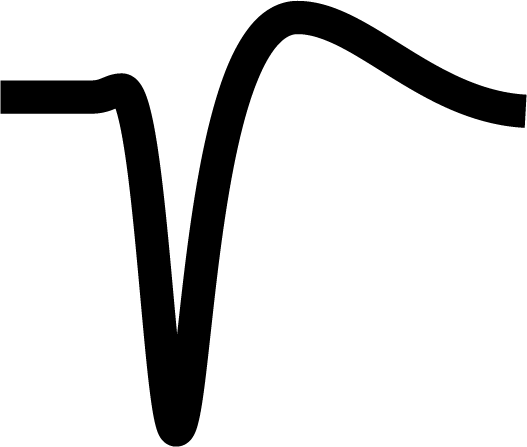

.. _PTB_EphysTab:

===================================
|Ephys| PTB Ephys Tab
===================================

.. toctree::
   :maxdepth: 2
   :hidden:

   PTB TDT Settings <PTB_TDTSettings>
   PTB Open Ephys <PTB_OESettings>
   PTB OptiTrack Settings  <PTB_OptitrackSettings>
   PTB Photodiode Settings  <PTB_PhotodiodeSettings>
   PTB Stimulation Settings  <PTB_StimSettings>

The :bdg-primary:`Ephys` tab of the Psych Toolbar GUI allows the user to edit settings related to specific electrophysiological recording and stimulation hardware.

.. |TDT| image:: _images/PTB_Icons/W_TDT.png
  :height: 40
  :alt: TDT

.. |PD| image:: _images/PTB_Icons/W_Photodiode.png
  :height: 40
  :alt: Photodiode

.. |Stim| image:: _images/PTB_Icons/W_Stimulation.png
  :height: 40
  :alt: Stimulation

.. csv-table:: 
  :file: _static/CSVs/PTB_EphysTab.csv
  :widths: 8 15 15 60
  :header-rows: 1
  :align: left
  :class: special

