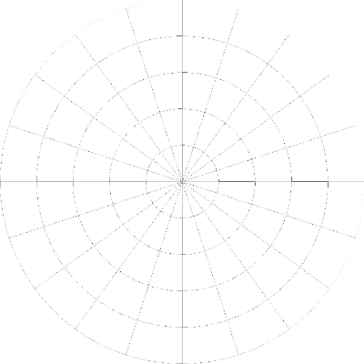

.. |Experiments| image:: _images/PTB_Icons/Experiment.png
  :width: 30
  :alt: Experiments

.. _PTB_ExperimentsTab:

===================================
|Experiments| PTB Experiments Tab
===================================

.. toctree::
   :maxdepth: 2
   :hidden:

   PTB Image Settings <PTB_ImageSettings>
   PTB Movie Settings <PTB_MovieSettings>
   PTB Visuotopy Settings <PTB_VisuotopySettings>
   PTB Saccade Map Settings <PTB_SaccadeMapSettings>

The :bdg-primary:`Experiments` tab of the Psych Toolbar GUI allows the user to launch apps to quickly load, edit and save variables related to specific pre-programmed experiments. The variables controlled by each app in the Settings tab are saved to a unique field of the :bdg-link-warning:`Params <PTB_ParamsObject>` object, as listed in the table below. Click on the icon or name of each experiment GUI to view its documentation, or click on the output structure to see the list of fields within each experiment's output structure.

.. panels::
  :column: col-lg-12 p-0 border-1
  :header: bg-primary text-bold p-1 pl-2
  :body: bg-secondary border-0 p-2

  :opticon:`info,mr-1` **Note**
  ^^^^^^^^^^^^^^^^^^^^^^^^
  If you are programming your own experiment and want to utilize Psych Toolbar controls or features, see the :ref:`guide to adding custom experiments <CustomExperiments>` for further information. 

.. |Movie| image:: _images/PTB_Icons/W_Movie.png
  :height: 40
  :alt: Movie
  :target: PTB_MovieSettings.html

.. csv-table:: 
  :file: _static/CSVs/PTB_ExperimentsTab.csv
  :header-rows: 1
  :widths: 8 15 15 60
  :align: left
  :class: special
  
