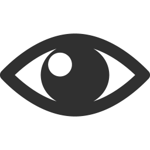

.. _PTB_EyeCalSettings:

=======================================
|Eye| PTB Eye Calibration Settings
=======================================

.. PTB_EyeCalSettings:

.. figure:: _images/PTB_GUIs/PTB_DisplaySettings.png
  :align: right
  :figwidth: 30%
  :width: 100%
  :alt: NIF Toolbar Session panel.

The :badge:`Eye Calibration Settings,badge-success` GUI allows the user to quickly set variables affecting the reward schedule for the subject based on timing and/or performance. All variables controlled by the Reward settings GUI are saved to the :ref:`Eye field <Params-Eye>` of the Params structure.

Params.Eye fields
======================

.. _Params-Eye:

Analog Input

