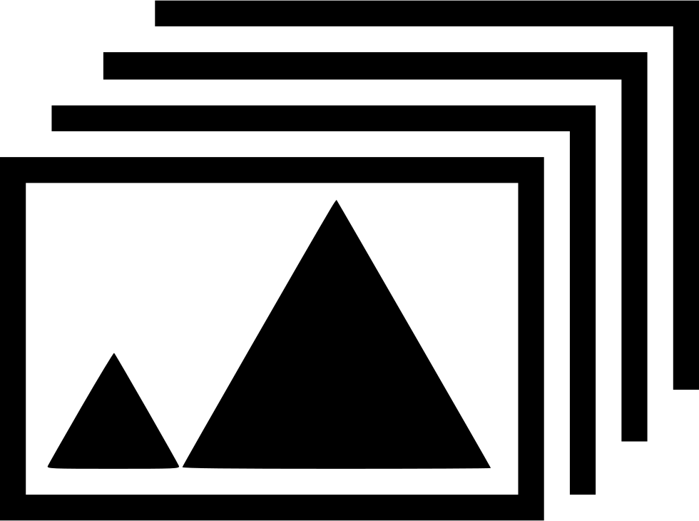
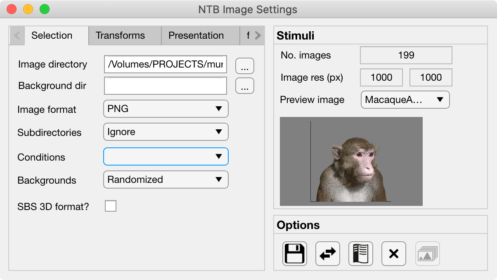

.. _PTB_ImageSettings:

=============================================
|Images| PTB Image Experiment Settings
=============================================

The :badge:`Image Settings,badge-success` GUI allows the user to quickly set parameters for experiments involving the visual presentation of static images. All variables controlled by the Image settings GUI are saved to the :ref:`Image field <Params-Image>` of the Params object.

.. container:: clearer

    .. image :: _images/spacer.png
       :width: 1

Tabs
=================

.. tab-set::

  .. tab-item:: Selection

    * :badge:`Image directory,badge-primary`: full path of the folder to load image stimuli from.

    * :badge:`Background directory,badge-primary`: full path of the folder to load background images from. If selected, background images will be presented behind the stimulus images and hence will only be visible where the stimulus image contains transparent pixels.

    * :badge:`Image format,badge-primary`: File format of the images to load. Images in other formats from the selected image directory will be ignored.

    * :badge:`Subdirectories,badge-primary`: Select how to treat subdirectories found inside the image directory:

      - **Ignore**: only load images found in the top level of the image directory.
      - **Load all**: search the image directory recursively and load all images from any subdirectories.
      - **Use as conditions**: treat each subdirectory found in the image directory as a separate experimental condition and load the images from each.

    * :badge:`Conditions,badge-primary`: If the **Subdirectories** field above is set to **Use as conditions** then this dropdown menu will be populated with the subdirectory names. Selecting a name in this dropdown menu will make the image preview jump to the first image belonging to that condition.

    * :badge:`Backgrounds,badge-primary`: Select how to use background images found in the **Background directory**. If there is a specific background image for each stimulus then background images should be named with a similar convention to the images so that they retain the same order. If there are fewer background images than stimulus images then the background can either be randomized per trial or randomized per block.

    * :badge:`SDS 3D format?,badge-primary`: Select this checkbox if the stimuli are in side-by-side (SBS) stereoscopic 3D format. For stereoscopic presentation, settings must also be updated in :ref:`PTB Display Settings GUI <PTB_DisplaySettings>`.

  .. tab-item:: Transforms

    * :badge:`Present fullscreen,badge-primary`:

    * :badge:`Stimulus width (units),badge-primary`: 

    * :badge:`Stimulus width,badge-primary`: 

    * :badge:`Use alpha channel?,badge-primary`:

    * :badge:`Color,badge-primary`:

    * :badge:`Apply mask,badge-primary`:

    * :badge:`Image rotation (°),badge-primary`:

    * :badge:`Image contrast,badge-primary`:

    * :badge:`Normalize luminance,badge-primary`: Luminance normalization of a set of images using the `SHINE Toolbox <http://www.mapageweb.umontreal.ca/gosselif/SHINE/>`_ (`Willenbockel et al., 2010 <https://doi.org/10.3758/BRM.42.3.671>`_). 

  .. tab-item:: Presentation

    * :badge:`Stimulus order,badge-primary`:

    * :badge:`Trials per run,badge-primary`:

    * :badge:`Stim. per trial,badge-primary`:

    * :badge:`Stim. duration (ms),badge-primary`:

    * :badge:`Inter-stim interval (ms),badge-primary`:

    * :badge:`Inter-trial interval (ms),badge-primary`:

    * :badge:`Temporal jitter (mean ms),badge-primary`:

    * :badge:`Temporal jitter (SD ms),badge-primary`:

  .. tab-item:: fMRI

    * :badge:`Add fixation blocks,badge-primary`: 

    * :badge:`Blocks per run,badge-primary`: 

    * :badge:`Stim. Per block,badge-primary`: 

    * :badge:`Stim. Duration (ms),badge-primary`: 

    * :badge:`Inter-stim interval (ms),badge-primary`: 

    * :badge:`Sync stim to TTL?,badge-primary`: 

Stimulus Panel
==================

* :badge:`No. Images,badge-primary`: This field displays the number of image files matching the specified :badge:`Image format,badge-primary` that are located in the specified badge:`Image directory,badge-primary`.

* :badge:`Image res (px),badge-primary`: If all of the images have the same dimensions then these fields display the horizontal (X) and vertical (Y) resolution of the images in pixels. 

* :badge:`Preview image,badge-primary`: This dropdown box lists the filenames of all located stimuli. The user can select any image from the dropdown list at it will load in the preview window below.

Options Panel
==================

.. |GUIname| replace:: Image

The Options panel is standardized across PTB Settings GUIs and contains buttons with icons indicating their function as listed below. You can also hover the cursor over the GUI buttons to see the tooltips description of each button's function.

.. |SaveDesc| replace:: Saves the current |GUIname| parameter values to the currently loaded Parameters file.

.. |Load| image:: _images/PTB_Icons/W_Transfer.png
  :width: 30
  :alt: Load

.. |LoadDesc| replace:: Allows the user to select a different Parameters file from the current one, and load only the |GUIname| parameters from that file.

.. |HelpDesc| replace:: Opens the PTB |GUIname| Settings GUI documentation page (this page) in a web browser.

.. |CloseDesc| replace:: Closes the PTB |GUIname| Settings GUI and returns the updated variables to the Params structure of the main Psych Toolbar.

.. |Textures| image:: _images/PTB_Icons/W_SlideShow.png
  :width: 30
  :alt: Load Textures

.. |TexDesc| replace:: Loads the selected images into PTB textures on the GPU ready for the experiment to run. Only enabled when a PTB window has already been opened.

.. table::
  :align: left
  :widths: 10 10 80

  +------------+-------------+----------------+
  | Icon       | Function    | Description    |
  +============+=============+================+
  | |Save|     | **Save**    | |SaveDesc|     |
  +------------+-------------+----------------+
  | |Load|     | **Load**    | |LoadDesc|     |
  +------------+-------------+----------------+
  | |Help|     | **Help**    | |HelpDesc|     |
  +------------+-------------+----------------+
  | |Close|    | **Close**   | |CloseDesc|    |
  +------------+-------------+----------------+
  | |Textures| | **Load im** | |TexDesc|      |
  +------------+-------------+----------------+

Params.Image fields
======================

.. _Params-Image:

.. csv-table:: 
  :file: _static/ParamsCsv/Image.csv
  :header: Subfield, Full field, Description
  :align: left
  :widths: 20 40 40

