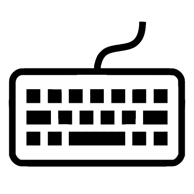

.. _PTB_KeyboardSettings:

===================================
|Keyboard| PTB Keyboard Settings
===================================

.. PTB_KeyboardSettings:

.. figure:: _images/PTB_GUIs/PTB_DisplaySettings.png
  :align: right
  :figwidth: 30%
  :width: 100%
  :alt: PTB Keyboard Settings

The :badge:`Keyboard Settings,badge-success` GUI allows the user to quickly set variables affecting .... All variables controlled by the Keyboard settings GUI are saved to the :ref:`Keys field <Params-Keys>` of the Params structure.

Params.Keys fields
======================

.. _Params-Keys:

Some stuff here

