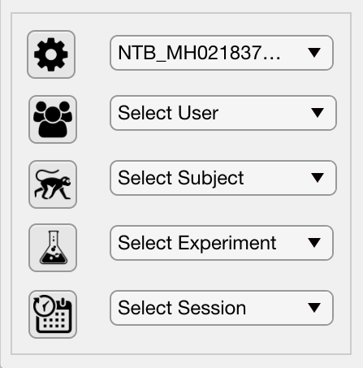

.. |Session| image:: _images/PTB_Icons/Calendar.png
  :width: 30
  :alt: Session

.. _PTB_SessionPanel:

======================================
:fa:`calendar-days` PTB Session Panel
======================================

.. |Params| replace:: :bdg-ref-warning:`Params <PTB_ParamsObject>`

The :bdg-primary:`Session` panel of the Psych Toolbar GUI allows the user to quickly load variables associated with a specific computer, researcher, subject, experiment and session date. All variables controlled by the Session panel are saved to the :ref:`Session field <Params-Session>` of the |Params| object.

.. |Settings| image:: _images/PTB_Icons/Settings.png
  :width: 30
  :alt: Load

|Settings| Parameters
=========================

The parameters file is a .mat file containing a |Params| object, which contains all of the experimental variables. By default, when the Psych Toolbar is launched it checks in the local :fa:`folder-open` ``PTB_Params`` folder for a .mat file containing the hostname of the computer on which it is currently running. If a single match is found then the file is automatically loaded. If no match is found or multiple matches are found, the user will immediately be asked to select a params (*.mat) file to load.

The parameters dropdown menu shows all of the available parameters files that are located in the same folder as the currently selected parameters file. Selecting another filename from this dropdown menu will load the parameters from that file. Clicking on the 'parameters' gear icon will allow you to select a new parameters file from any directory.

.. |Subject| image:: _images/PTB_Icons/Subject.png
  :width: 30
  :alt: Load

.. |Experiment| image:: _images/PTB_Icons/Experiment.png
  :width: 30
  :alt: Load

.. |Session| image:: _images/PTB_Icons/Calendar.png
  :width: 30
  :alt: Load

.. csv-table:: 
  :file: _static/CSVs/PTB_ActionsTab.csv
  :header-rows: 1
  :widths: 10 30 60
  :align: left

.. _Params-Session:

Params.Session fields
=========================
