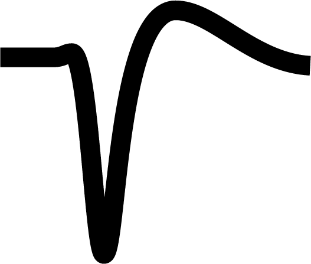
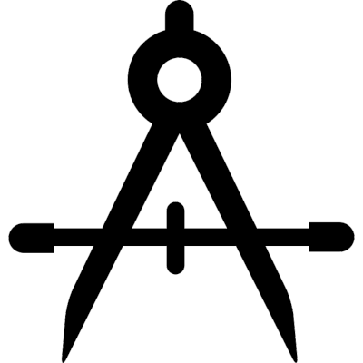

.. card::
  :class-header: sd-bg-primary
  :class-body: sd-bg-light
  :img-bottom: _images/PTB_GUIs/PsychToolbar.png

  .. image:: _images/Logos/PTB_Logo_w.png
    :height: 60
    :class: dark-light

  ^^^

  Psych Toolbar is a suite of graphical user interfaces (GUIs) and functions for `Matlab <https://www.mathworks.com/products/matlab.html>`_, intended to simplify the management of experimental control parameters for running behavioral neuroscience experiments. Psych Toolbar is written in the Matlab interpreted language and designed to interface with commonly used Matlab extensions for behavioral neuroscience, namely `PsychToolbox <https://psychtoolbox.org/>`_.

  Psych Toolbar was initially developed at the National Institutes of Health, for use in functional brain imaging and electrophysiology studies in awake, behaving animals. It is made available to the research community as a more open-ended and customizable alternative to the excellent `NIMH Monkey Logic <https://monkeylogic.nimh.nih.gov/>`_ extension for Matlab, which is also worth considering for your research needs.

.. _Psych_Toolbar_Home:

.. figure:: _images/PTB_Images/DisplayMockUp.png
  :align: right
  :figwidth: 100%
  :width: 100%
  :alt: PTB Display Example

.. container:: clearer

    .. image :: _images/spacer.png
       :width: 1

===============
PsychToolbar
===============

Basic Overview
================

Psych Toolbar is flexibly designed to be of benefit to both novice and experienced researchers. For the novice with little programming experience, the Psych Toolbar's graphic environment offers an intuitive way of getting simple visual experiments up and running quickly. For this purpose, a series of commonly used experimental templates are provided, including:

* :fa:`eye` Eye-tracker calibration
* :fa:`images` Presentation of static images (e.g. fMRI 'face patch localizer')
* :fa:`video` Presentation of movie clips (e.g. fMRI block design)
* :fa:`chess-board` Presentation of abstract graphics (e.g. dot motion, gratings, retinotopic mapping stimuli)

For the advanced user, Psych Toolbar provides a fast and user-friendly means of editing and organizing the many variables involved (via GUIs), which can then be optionally accessed in your own experimental code through the :bdg-ref-warning:`Params <PTB_ParamsObject>` `object class <https://www.mathworks.com/help/matlab/matlab_oop/example-representing-structured-data.html>`_. PTB sub-functions allow common tasks that may occur throughout an experiment (e.g. reward delivery) to be executed with a single line of code, thus minimizing the amount of code required to write new experiments.

Panels and Tabs
===================

.. |Session| image:: _images/PTB_Icons/Calendar.png
  :width: 40
  :alt: Session
  :target: PTB_SessionPanel.html

.. |Experiments| image:: _images/PTB_Icons/Experiment.png
  :width: 40
  :alt: Experiments
  :target: PTB_ExperimentsTab.html

.. |fMRI| image:: _images/PTB_Icons/EPI.png
  :width: 40
  :alt: fMRI
  :target: PTB_fMRITab.html

.. csv-table::
  :file: _static/CSVs/PsychToolbarTabs.csv
  :header-rows: 1
  :widths: 10 20 60
  :align: left

Installation
===================

The Psych Toolbar can be either downloaded or cloned from the `GitHub repository <https://github.com/Phenomenal-Cat/Psych-Toolbar>`_. The computer system should already be configured as outlined in :ref:`SystemInstall`.

Contents
===============================

.. toctree::
   :maxdepth: 2

   PTB Session Panel <PTB_SessionPanel>
   PTB Actions Tab <PTB_ActionsTab>
   PTB Settings Tab <PTB_SettingsTab>
   PTB Experiments Tab <PTB_ExperimentsTab>
   PTB fMRI Tab <PTB_fMRITab>
   PTB Ephys Tab <PTB_EphysTab>
   PTB Calibrations Tab <PTB_CalibrationsTab>
   PTB Review Panel <PTB_ReviewPanel>
   PTB Hardware <PTB_Hardware>
   
   

Indices and tables
==================

* :ref:`genindex`
* :ref:`modindex`
* :ref:`search`

